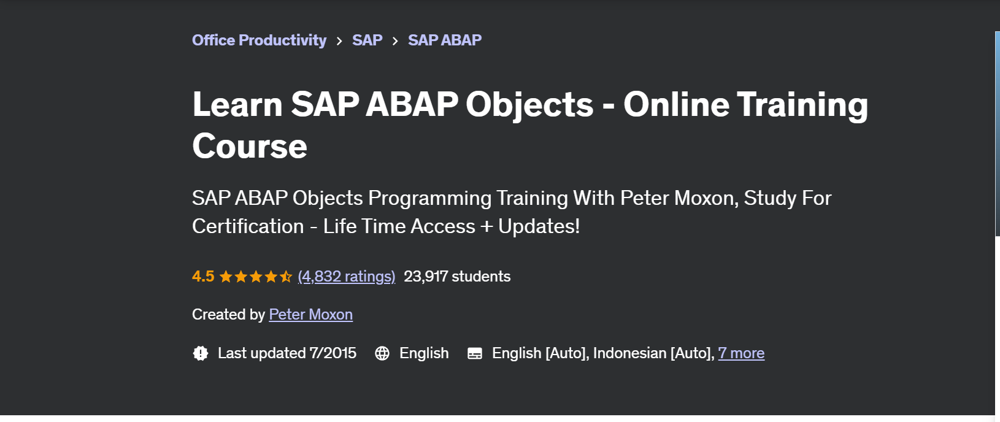

# Learning_ABAP
Course work associated with the Udemy.com courses:
* "SAP ABAP Programming For Beginners - Online Training" -> https://www.udemy.com/course/sap-abap-programming-for-beginners/  (introduction to procedural ABAP Language)
* "Learn SAP ABAP Objects - Online Training Course" ->  https://www.udemy.com/course/abap-objects/  (OOP ABAP Language)

